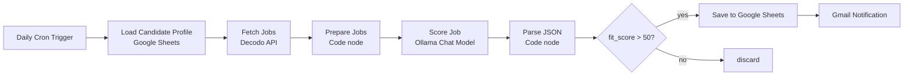
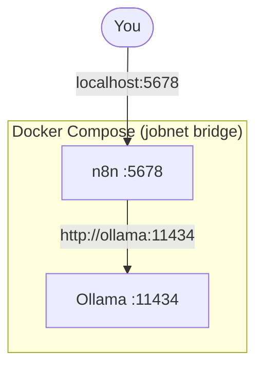

# Local AI Job-Search Automation — n8n + Ollama (100% Private)

A self-hosted, fully local pipeline that **finds remote jobs, scores them against my profile with a local LLM, and emails me only the strong matches** — every morning, automatically. No OpenAI key, no cloud AI, no data leaving my machine.


-000000)


---

##  What it does

Instead of manually searching job boards every day, this workflow:

-  **Triggers daily** on a schedule (n8n Cron).
-  **Fetches job listings** via the Decodo Scraping API.
-  **Scores each job 0–100** against my candidate profile using a **local Ollama model** acting as a professional recruiter (returns structured JSON).
-  **Filters** to keep only matches with `fit_score > 50`.
-  **Logs results to Google Sheets** (de-duplicated by job URL).
-  **Emails me** each qualifying match with the score, reasoning, and apply link.

The AI runs entirely on my own hardware — the only things that leave the laptop are the job-board fetch and the Google/Gmail sync I explicitly authorize.

---

##  Architecture



The two services run as containers on a shared Docker bridge network, so n8n reaches the model privately at `http://ollama:11434`:



---

##  Tech stack

| Layer | Tool |
|---|---|
| Orchestration | **n8n** (self-hosted) |
| Local AI / LLM | **Ollama** running **Llama 3.1 8B** |
| Containerization | **Docker Compose** (WSL2 on Windows 11) |
| Data acquisition | **Decodo** Scraping API |
| Storage | **Google Sheets** |
| Notifications | **Gmail** |

---

##  Quick start

```bash
# 1. Clone
git clone https://github.com/<your-username>/local-ai-job-search.git
cd local-ai-job-search

# 2. (optional) set your timezone
cp .env.example .env      # then edit TZ

# 3. Start the stack
docker compose up -d

# 4. Pull the model into Ollama (one time)
docker exec -it ollama ollama pull llama3.1:8b

# 5. Open n8n and import the workflow
#    http://localhost:5678  →  Workflows → Import from File → job-search-workflow.json
```

Full, beginner-friendly instructions (credentials, Google Sheets, troubleshooting) are in **[SETUP-GUIDE.md](SETUP-GUIDE.md)**.

---

##  Repository contents

| File | Purpose |
|---|---|
| `docker-compose.yml` | Spins up n8n + Ollama on a shared network |
| `job-search-workflow.json` | The importable n8n workflow |
| `ollama-system-prompt.txt` | The recruiter system prompt (strict JSON output) |
| `SETUP-GUIDE.md` | Detailed step-by-step setup + troubleshooting |
| `.env.example` | Sample configuration |

>  **Security:** No credentials are stored in this repo. n8n keeps API keys/OAuth tokens encrypted inside its own Docker volume (`n8n_data`, gitignored). The workflow JSON contains only placeholder credential references.

---

##  What I learned building this

- **Container networking:** why `localhost` fails between containers and how a shared Docker bridge + service-name DNS (`http://ollama:11434`) solves it.
- **Running LLMs locally** with Ollama and wiring them into n8n's LangChain nodes instead of a paid API.
- **Prompt engineering for structured output** — forcing a local model to return clean, parseable JSON for a downstream filter.
- **Debugging real integration auth**: Google Sheets OAuth account mismatches, and HTTP Basic auth formatting for a third-party scraping API.
- **Designing an idempotent pipeline** — de-duplicating by job URL so re-runs don't create duplicates.

---

##  Possible next steps

- "Only notify me about **new** jobs" de-duplication layer.
- Multiple job sources / search queries.
- A small dashboard summarizing scores over time.
- Swap in a smaller model (`llama3.2:3b`) for low-resource machines.

---

##  License

MIT — see [LICENSE](LICENSE). Built with n8n + Ollama + Decodo + Google Sheets + Gmail.
